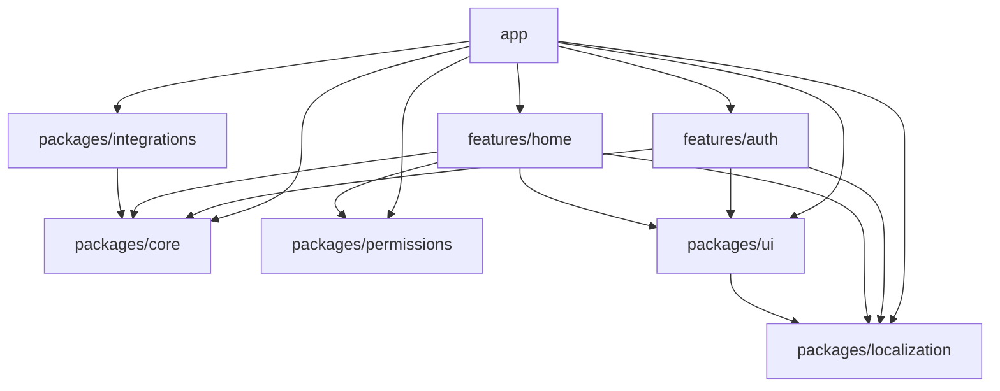

# 架構總覽

**本文件是「東西放哪、怎麼連」這類規則的權威來源。** 涵蓋 workspace 拓撲、
依賴方向、關鍵鏈路與全域行為的歸屬。

「怎麼寫」的規則(命名、Bloc 鐵律、錯誤模型、測試)見
[`conventions.md`](conventions.md)。

所有程式碼片段皆節錄自現存檔案並標註路徑。

## 1. Workspace 拓撲

根 [`pubspec.yaml`](../pubspec.yaml) 的 `workspace:` 清單即為單一真相:

<!-- BEGIN GENERATED: workspace-list -->
```yaml
workspace:
  - app
  - features/auth
  - features/home
  - packages/core
  - packages/integrations
  - packages/localization
  - packages/permissions
  - packages/ui
```
<!-- END GENERATED: workspace-list -->

<!-- BEGIN GENERATED: member-count -->
8 個成員 = 1 個 `app` + 5 個 `packages/*` + 2 個 `features/*`
<!-- END GENERATED: member-count -->

(ADR-0006 由 12 個收斂而來。)心智模型一句話講得完:**技術基礎設施放 `core`,共用 UI 元件放 `ui`,文案放 `localization`,其餘都在自己的 feature 裡。** 每個成員一句話職責(取自各自 `pubspec.yaml` 的 `description`):

<!-- BEGIN GENERATED: topology -->
| 成員 | 職責(一句話) |
|---|---|
| `app` | 組裝層:flavor 進入點、DI、路由、shell。 ([`app/pubspec.yaml`](../app/pubspec.yaml)) |
| `features/auth` | 登入功能:domain/data 層、AuthTokenRefreshGateway、路由與 DI 註冊。 ([`features/auth/pubspec.yaml`](../features/auth/pubspec.yaml)) |
| `features/home` | 首頁功能:domain/data/presentation 層(項目清單與詳情頁、blocs)。 ([`features/home/pubspec.yaml`](../features/home/pubspec.yaml)) |
| `packages/core` | 技術基礎設施:Result/例外、網路、儲存、session、observability、路由契約。不含 UI widget。 ([`packages/core/pubspec.yaml`](../packages/core/pubspec.yaml)) |
| `packages/integrations` | 第三方服務整合(Firebase:analytics/crashlytics/messaging)。**可選成員**——不用 Firebase 的專案整包移除,見 docs/how-to/remove-firebase.md。 ([`packages/integrations/pubspec.yaml`](../packages/integrations/pubspec.yaml)) |
| `packages/localization` | 多語系(官方 gen-l10n + ARB),含各 feature 文案。 ([`packages/localization/pubspec.yaml`](../packages/localization/pubspec.yaml)) |
| `packages/permissions` | 權限請求的統一介面與 permission_handler 實作;不直接暴露第三方型別。 ([`packages/permissions/pubspec.yaml`](../packages/permissions/pubspec.yaml)) |
| `packages/ui` | design tokens、theme、共用 UI 元件與頁面外框元件。 ([`packages/ui/pubspec.yaml`](../packages/ui/pubspec.yaml)) |
<!-- END GENERATED: topology -->

`core` 內部以資料夾分區(`src/foundation`、`src/networking`、`src/persistence`、`src/session`、`src/observability`、`src/navigation`、`src/push`),這些邊界原本由 pubspec 強制,收斂後降級為資料夾自律——**已知代價,詳見 ADR-0006**。`features/*` 之間由 pubspec 強制的隔離完全未動,那才是真正會出事的地方。

`packages/native/<capability>` 是原生能力群的插槽位置(見
[`docs/how-to/add-a-native-capability.md`](how-to/add-a-native-capability.md)),
本模板尚未附示範能力,故不在上表之列。

## 2. 依賴方向規則(四條)

1. `core` 是依賴鏈的底層,只依賴第三方套件(dio、shared_preferences、flutter_secure_storage)與 Flutter,不依賴任何其他 workspace 成員。**注意 `core` 含 Flutter**——切線是「技術基礎設施 vs 業務功能」,不是「碰不碰 Flutter」(見 ADR-0006)。
2. `packages/*` 之間允許依賴,但必須單向、且在本文件的依賴圖中明列;永遠不能依賴 `features/*` 或 `app`。
3. `features/*` 可依賴 `packages/*`;**永遠不能依賴其他 feature**,不能依賴 `app`。
4. `app` 是唯一什麼都能依賴的地方,負責組裝(DI、路由表、flavor 進入點),自身幾乎不含邏輯。

機制(規格首段的精準描述):pub workspace 是共享 resolution,未宣告依賴的 import 仍編譯得過;真正守住邊界的是 `analysis_options.yaml` 把 `depend_on_referenced_packages` 升為 **error** 級 + CI 的 `flutter analyze` 硬性把關,加上 `tool/check.sh` 的「pubspec 依賴稽核」步驟(見下)。也就是說邊界是「pubspec 宣告式 + lint error + CI 強制」,機器可驗證、不靠人力紀律,但不是編譯器級。

`depend_on_referenced_packages` 只能擋「未宣告卻 import」;擋不住「宣告了被禁止的依賴」(如某 package 在 `pubspec.yaml` 直接寫 `home: any`)。這一半由 [`tool/check.sh`](../tool/check.sh) 第 4 步的腳本稽核補上:掃描 `features/*` 的 `dependencies:` 區段不得含其他 `features/*`,`packages/*` 的 `dependencies:` 區段不得含任何 `features/*` 或 `app`。四條規則因此全數機器可驗證。

### 2.1 依賴白名單(從各 `pubspec.yaml` 現況彙整)

僅列 workspace 內部依賴(第三方套件如 `dio`、`flutter_bloc` 省略)。

<!-- BEGIN GENERATED: dependency-table -->
| 成員 | 依賴的 workspace 成員 |
|---|---|
| `app` | `auth`、`core`、`home`、`integrations`、`localization`、`permissions`、`ui` |
| `features/auth` | `core`、`localization`、`ui` |
| `features/home` | `core`、`localization`、`permissions`、`ui` |
| `packages/core` | (無) |
| `packages/integrations` | `core` |
| `packages/localization` | (無) |
| `packages/permissions` | (無) |
| `packages/ui` | `localization` |
<!-- END GENERATED: dependency-table -->

### 2.2 依賴圖(mermaid)

<!-- BEGIN GENERATED: dependency-graph -->

<!-- END GENERATED: dependency-graph -->

## 3. 三條關鍵鏈路

### 3.1 401 refresh 鏈

單一飛行(single-flight)且不遞迴的 token 換發,橫跨三個 package:

1. **`AuthInterceptor`**([`packages/core/lib/src/networking/auth_interceptor.dart`](../packages/core/lib/src/networking/auth_interceptor.dart))——`QueuedInterceptor`,`onRequest` 注入 `Authorization` header;`onError` 在收到 401 且該請求尚未重試過時,呼叫 `TokenProvider.refreshTokens`,成功後用 `_retryClient`(不含本攔截器的獨立 `Dio`)重送一次。若失敗請求所帶的 token 已與現行 token 不同(代表併發的另一請求期間已完成 refresh),直接沿用現行 token 重試,不再重覆呼叫 `refreshTokens`。
2. **`TokenProvider`**([`packages/core/lib/src/networking/token_provider.dart`](../packages/core/lib/src/networking/token_provider.dart))——`networking` 只定義的介面(`currentAccessToken` / `refreshTokens`),不實作,避免 `networking → session` 的循環依賴。
3. **`SessionManager`**([`packages/core/lib/src/session/session_manager.dart`](../packages/core/lib/src/session/session_manager.dart))——實作 `TokenProvider`。`refreshTokens` 以 `_inflightRefresh` 欄位做單一飛行:同時多個請求觸發 401 時只會有一次真正的 `_doRefresh`,其餘呼叫共用同一個 `Future`。
4. **`AuthTokenRefreshGateway`**([`features/auth/lib/src/data/auth_token_refresh_gateway.dart`](../features/auth/lib/src/data/auth_token_refresh_gateway.dart))——`SessionManager._doRefresh` 呼叫的實際換發實作,建構參數 `ApiClient` 必須以 `createPlainDio`(不含 `AuthInterceptor`)組裝,否則 refresh 請求本身收到 401 會遞迴觸發 refresh。這個「plain client」工廠見 [`packages/core/lib/src/networking/create_dio.dart`](../packages/core/lib/src/networking/create_dio.dart) 的 `createPlainDio`,並在 [`app/lib/src/di/compose_dependencies.dart`](../app/lib/src/di/compose_dependencies.dart) 組裝時傳入 `TokenRefreshGateway` 的註冊式。

依賴方向:`session → networking → foundation`。

已知邊角:沒有帶 `Authorization` header 的請求(尚未登入前發出的公開 API)若收到 401,`AuthInterceptor` 會直接以現行 token 重試一次,不觸發 `refreshTokens`——因為判斷「是否已重試過」看的是 token 是否變動,無 header 時沒有 token 可比對,退回同一路徑。此為有意識接受的邊角,不視為 bug。

### 3.2 bootstrap 五步

唯一實作於 [`app/lib/src/bootstrap.dart`](../app/lib/src/bootstrap.dart) 的 `bootstrap`:

```dart
Future<void> bootstrap(AppConfig config) async {
 WidgetsFlutterBinding.ensureInitialized; // 1
 final gi = GetIt.instance;
 await composeDependencies(gi, config); // 2 純註冊
 installErrorHooks( // 3
 logger: ConsoleLogger,
 reporter: gi<CrashReporter>,
 );
 await gi.allReady; // 4a persistence 等就緒
 if (config.firebaseEnabled) { // 4b
 await Firebase.initializeApp;
 await gi<BufferingCrashReporter>.attach(
 CrashlyticsCrashReporter(FirebaseCrashlytics.instance),
 );
 }
 await gi<SessionManager>.restore; // 4c
 runApp(App(gi: gi)); // 5
}
```

1. `WidgetsFlutterBinding.ensureInitialized`。
2. `composeDependencies(gi, config)`——純註冊,不做 I/O。
3. 掛載全域錯誤捕捉:`FlutterError.onError` + `PlatformDispatcher.instance.onError` → `observability`(`installErrorHooks`,同檔)。
4. `await` 必要初始化:`gi.allReady`(persistence 等就緒)→(若 `firebaseEnabled`)`Firebase.initializeApp` 並把 `BufferingCrashReporter` 接上真正的 `CrashlyticsCrashReporter` → `SessionManager.restore`。
5. `runApp(App(gi: gi))`。

第 3 步先於第 4b 步(Firebase init)掛上錯誤捕捉,期間發生的例外由 `BufferingCrashReporter` 緩衝、`attach` 時排水補送(詳見 [ADR-0005](adr/0005-buffering-crash-reporter.md))。

### 3.3 三個全域行為的唯一處

| 行為 | 唯一處(檔案) | 說明 |
|---|---|---|
| 登入守衛 | [`app/lib/src/router/app_router.dart`](../app/lib/src/router/app_router.dart) 的 `buildRouter` `redirect` | 讀 `session.state`:未登入且目標非 login → 導向 login;已登入且目標為 login → 導向 home。`refreshListenable`(見 [`app/lib/src/router/session_refresh_listenable.dart`](../app/lib/src/router/session_refresh_listenable.dart))訂閱 `SessionManager.states`,每次事件觸發 go_router 重新評估 `redirect`。 |
| token 失效登出 | [`packages/core/lib/src/session/session_manager.dart`](../packages/core/lib/src/session/session_manager.dart) 的 `_doRefresh` 呼叫 `signOut`(清除本地 tokens、發布 `SessionUnauthenticated`)+ 上列 `app_router.dart` 的 `redirect` 對該狀態反應 | refresh 回傳 `UnauthorizedException` 時才真正登出(`_doRefresh` 內以 `exception is UnauthorizedException` 判斷);其餘暫時性失敗(斷網、5xx)保留 tokens,不登出。清資料的唯一處是 `SessionManager`,「導回登入」的唯一處是 router 的 `redirect`——兩者透過 `states` stream 串接,app 層不再另外訂閱。 |
| 推播點擊轉路由 | [`app/lib/src/app.dart`](../app/lib/src/app.dart) 的 `_AppState.initState` | 訂閱 `PushNotifications.taps`,`routePath` 非 null 時 `_router.go(routePath)`;另於首幀後呼叫 `PushNotifications.initialTap` 處理冷啟動點擊。兩者最終都經過上列 router 的登入守衛評估。 導向前先經 [`push_route_guard.dart`](../app/lib/src/router/external_route_guard.dart) 的 `resolvePushRoute` 校驗:**只有 `PushAllowedRoutes.exact` 命中才放行**,`subtrees` 需明確 opt-in;query 與 fragment 一律丟棄;被拒絕的路徑記 `AppLogger.warning`。要讓新頁面可被推播導向,加進 `exact`;只有確認整個子樹都安全時才用 `subtrees`。 **推播與 deep link 共用同一份白名單**(`ExternalAllowedRoutes`)——安全防護只蓋住一半等於沒蓋。deep link 的 native 設定與已知缺口見 [`docs/how-to/configure-deep-links.md`](how-to/configure-deep-links.md)。 |
| 頁面瀏覽埋點 | [`app/lib/src/router/analytics_observer.dart`](../app/lib/src/router/analytics_observer.dart) 的 `AnalyticsNavigatorObserver`,掛在 go_router 的 `observers`。所有頁面自動涵蓋,**feature 不得自行在頁面呼叫 `trackScreen`**。路由必須設 `name`(snake_case、不含動態參數、跨 feature 唯一),沒設時 go_router 會塞路由 pattern 進來,observer 會過濾含 `:` 的髒名稱。 |

### 3.4 啟動 gate(強制更新/維護模式)歸屬(規範性指引)

強制更新與維護模式**已實作**(#27),模板出貨的是**機制**,判斷依據留成擴充點:

| 項目 | 位置 |
|---|---|
| 契約與出廠實作 | [`app/lib/src/startup/startup_gate.dart`](../app/lib/src/startup/startup_gate.dart)(`StartupGate` / `AlwaysAllowedStartupGate`) |
| 狀態持有與防重入 | [`startup_gate_controller.dart`](../app/lib/src/startup/startup_gate_controller.dart)(`ChangeNotifier`,餵給 router 的 `refreshListenable`) |
| 檢查時機 | `bootstrap.dart` 第 4d 步(`runApp` 之前)+ 每次回到前景(`didChangeAppLifecycleState`) |
| 攔截位置 | `app_router.dart` 的 `redirect` **最高優先層**,排在登入守衛之前 |
| 被擋畫面 | [`startup_blocked_page.dart`](../app/lib/src/startup/startup_blocked_page.dart),掛在 `ShellRoute` **之外** |

兩個關鍵決策:**gate 排在登入守衛之前**(否則維護模式對未登入使用者無效)、
**gate 檢查失敗一律放行**(把使用者鎖在門外的代價遠大於漏擋一次)。

怎麼接上真實判斷依據見 [`docs/how-to/add-force-update.md`](how-to/add-force-update.md)
——實作 `StartupGate`、換掉 DI 那一行,不必改 bootstrap 或 router。

## 3.5 跨 feature 的業務資料:consumer port + app adapter

§2 的第 3 條說「`features/*` 永遠不能依賴其他 feature」。**這條規則最常被挑戰
的時刻,是一個 feature 需要另一個 feature 擁有的業務事實時。**

具體情境:`features/member` 擁有會員資料 API 與手機綁定流程,`features/payment`
結帳前必須知道「這個會員綁手機了沒」。

沒有寫死做法的話,團隊會長出以下其中一種,而每一種都會侵蝕隔離:

| 常見做法 | 為什麼不行 |
|---|---|
| 開 `features/shared` / `common` / `utils` | 名字沒有邊界,任何東西都「算是」共用。最後每個 feature 都依賴它,pubspec 擋的那條線等於不存在。**這個已由 `tool/new_feature.dart` 與 `tool/guard.sh` 機器擋住。** |
| payment 直接依賴 member | 直接違反第 3 條,`check.sh` 的 pubspec 依賴稽核會擋 |
| 把會員資料搬進 `core` | `core` 是技術基礎設施。放業務資料進去,它就開始依賴每個 feature 的業務詞彙 |
| 在 `packages/*` 開一個業務 package | 同上,`packages/*` 的職責是技術能力、共用 UI、多語系、原生能力、第三方 SDK 轉接 |
| 在 payment 裡複製一份 member 的 API 與 DTO | 兩份會漂,而且後端改欄位時只有一邊會被改到 |
| 把協調邏輯寫進 `app` | `app` 是組裝層。開始放業務判斷,它就慢慢變成第二個業務層 |

**定案做法:consumer 擁有 port,`app` 寫 adapter。** 也就是在組裝根做依賴反轉。

```text
app ──> member          member  ─X─> payment
app ──> payment         payment ─X─> member
```

四條規則:

1. **消費端定義自己需要的窄介面(port)**,放在自己的 feature 裡。它描述的是
   「payment 需要知道什麼」,不是「member 能提供什麼」。
2. **生產端從 barrel 匯出公開的讀取契約**,回傳自己的 domain 型別。**DTO 不外流。**
3. **`app/lib/src/bridges/` 放 adapter**,同時 import 兩邊的公開 API,把生產端
   的契約翻譯成消費端的 port。`composeDependencies` 註冊它。
4. **業務政策留在消費端 feature**。adapter 只做讀取與型別翻譯,**不得**含業務
   判斷、UI、儲存,或自己發網路請求。

判準一句話:**「payment 綁手機了沒才能結帳」這條規則屬於 payment,所以它留在
payment。「怎麼拿到綁定狀態」是接線,所以它在 `app`。**

完整範例(含 OTP 這類多結果流程、多個消費端共用同一個生產端 reader 的做法、
以及測試怎麼寫)見
[`docs/how-to/bridge-cross-feature-capability.md`](how-to/bridge-cross-feature-capability.md)。

**已知代價**:跨 feature 整合每多一組,`app/lib/src/bridges/` 就多一個檔案。
這是刻意的——代價是組裝根多一些機械的轉接程式碼,換到的是**每一條跨 feature
依賴都看得見、測得到、而且繞不過 pubspec 邊界**。

adapter 數量若真的成長到變成維護熱點,那是「要不要引入 `domains/*` 這一層」的
訊號,**需要一份新的 ADR 加上對應的護欄改動**,不能默默長出來。

## 4. 相關文件

- 命名、Bloc 規範、測試規範等寫作慣例:[`conventions.md`](conventions.md)
- 架構決策紀錄:[`adr/`](adr/)
